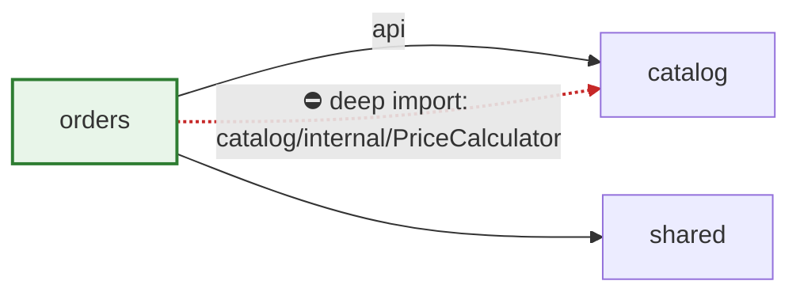

# Deep Review

Systematic PR/MR review in four phases: gather context, load the matching reference guides, review, report with evidence. The reference
guides carry the actual standards — this file only orchestrates. The skill is host-agnostic (GitHub `gh` or GitLab `glab`).

## Phase 0: Platform

Detect the host from the git remote and read the command map — **before** any host command runs:

- Derive the platform from `origin` (`git remote get-url origin` → `github.com` ⇒ `gh`, `gitlab*` ⇒ `glab`; self-hosted ⇒ fall back to whichever CLI is authenticated, else ask).
- **Read [Platform Commands](reference/platform-commands.md) now.** Every `gh …`/`glab …` invocation below is a *pointer* to the operation map in that file — pick the row for the detected platform. Use the host's own vocabulary in the report (PR on GitHub, MR on GitLab).

## Phase 1: Context

1. Read the PR description and linked issue; understand the business requirement and check CI status
2. Discover the repo's house rules and the PR is reviewed against these, not just general best practice.
   — root + ancestor `CLAUDE.md`, `CONTRIBUTING.md`
   - ADRs, and the changed modules' `BLUEPRINT.md`/`REQUIREMENTS.md`
3. Optional triage for large diffs: `git diff main...HEAD | python scripts/pr-analyzer.py`

## Phase 2: Load References (MANDATORY)

Reference files are NOT loaded automatically — links in this skill are pointers, not content. Inspect the diff (file extensions,
imports, changed content) and **Read every matching reference file with the Read tool now**. Keep a list of what you read — the report
must cite it (Phase 4).

| If the PR contains…                                                       | Read these references                                                                     |
| ------------------------------------------------------------------------- | ----------------------------------------------------------------------------------------- |
| **Any change (always)**                                                   | [House Rules](reference/house-rules.md), [Code Quality Guide](reference/code-quality.md)  |
| **React / frontend (`.tsx`/`.jsx`, components, hooks)**                   | [React & Frontend Guide](reference/react.md), [TypeScript Guide](reference/typescript.md) |
| **TypeScript (`.ts`, non-React)**                                         | [TypeScript Guide](reference/typescript.md)                                               |
| **Kotlin (`.kt`/`.kts`, Android or backend)**                             | [Kotlin Guide](reference/kotlin.md)                                                       |
| **C++ (`.cpp`/`.cc`/`.h`/`.hpp`)**                                        | [C++ Guide](reference/cpp.md)                                                             |
| **Qt / QML (`.qml`, `QObject`/`Q_OBJECT`, `Qt::` APIs, Qt CMake)**        | [Qt & QML Guide](reference/qt-qml.md) — plus [C++ Guide](reference/cpp.md) if C++ changed |
| **Other languages (Python, Go, Rust, Java, Vue, C, SQL, API design)**     | [Common Bugs Checklist](reference/common-bugs-checklist.md)                               |
| **Auth, input handling, secrets, SQL, file uploads, external data**       | [Security Review Guide](reference/security-review-guide.md)                               |
| **Loops over collections, DB queries, hot paths, large payloads**         | [Performance Review Guide](reference/performance-review-guide.md)                         |
| **New abstractions, module/structural changes, modulith boundaries**      | [Architecture Review Guide](reference/architecture-review-guide.md)                       |

Do not proceed until every matched reference has been read in this session. A PR spanning multiple categories (e.g. React + Kotlin backend) gets all matching sets.

## Phase 3: Review

High-level first — does the solution fit the problem?

- **Architecture & design** — SOLID, coupling/cohesion, anti-patterns; in a modulith, module boundaries: cross-module imports target public APIs only, no new cycles, no shared tables, no transactions spanning modules
- **House rules** — letter (no changed line breaks a written rule), architecture (no ADR silently reversed), process (required tests/docs-sync/migrations done), intent (diff matches the linked issue; scope creep raised as a question)
- **Testing strategy** — new functionality covered by integration tests, behavior over implementation

Then line-by-line, per file:

- **Logic & correctness** — edge cases, off-by-one, null checks, race conditions
- **Security** — input validation, injection risks, XSS, sensitive data
- **Performance** — N+1 queries, unnecessary loops, memory leaks
- **Maintainability & reuse** — clear names, single responsibility; before accepting new code, search adjacent files and shared modules for existing utilities/components that could replace it

Apply the standards from the references loaded in Phase 2 — they define what good looks like in each area.

## Phase 4: Report

Use the [PR Review Template](assets/pr-review-template.md) ([quick checklist](assets/review-checklist.md)) as a strict output
contract: same sections, same order, omit empty sections, add nothing else. The report contains, in order:

1. `<!-- deep-review sha:<head-sha> -->` marker, stamping the PR/MR head commit this review looked at
   (Head SHA row of [Platform Commands](reference/platform-commands.md)) — the companion `deep-review-followup` skill
   diffs against it to validate the author's fixes. Then the **verdict on the first line**: ✅ Approve / 💬 Comment (minor, can merge) /
   🔄 Request Changes (must address) — plus a one-clause justification. The verdict appears only here; never re-summarize
   the findings at the end of the report.
2. **Summary** — 2–3 sentences on what the PR does, then a compact touched-modules table. One row per module; a cell holds
   at most two short lines, never a paragraph.
3. Findings grouped by severity (labels below). Finding shape: `**Title** — \`file:line\``, 1–2 sentences of evidence,
   then `_Repro:_` / `_Fix:_` lines (evidence matched to the finding kind — see Reporting Discipline). The title is a
   distilled headline for eye-scanning: a short noun phrase naming the defect (≤ ~50 characters), so title + path
   render as one line — nuance and qualifiers belong in the evidence sentences, never in the title.
4. **Verified clean** — at most 3 one-line bullets: non-obvious things you checked that hold up. Coverage evidence for
   co-reviewers ("checked X, unaffected"), not praise.
5. **Module Coupling Map** — only when the PR adds or changes a cross-module edge, or a boundary violation exists (see below)
6. **"References Used" line** — every reference actually read in Phase 2
   - comma-separated in backticks (e.g. `house-rules.md`, `react.md`)
   - never omit it; never list a file that wasn't read.

Never include: PR/MR statistics (size, line/file counts — the host shows them), review-time estimates, CI status prose (the
host shows the checks/pipeline), or checkbox checklists. The verdict and any blocking finding must fit in the first screenful.

### Posting

- Post the report as a PR/MR comment (post/update rows of [Platform Commands](reference/platform-commands.md)), unless the user opted out.
- **Only the orchestrating agent posts.** If the review fans out to subagents, they must never run the post/update
  commands or write to the git host in any other way — they return findings to the main agent, which verifies,
  consolidates, and posts exactly one comment. State this restriction explicitly in every subagent prompt.
- **Re-runs update, never stack:** before posting, list the change's top-level comments and take the existing one
  starting with `<!-- deep-review`; update *that* comment (PATCH on GitHub, PUT on GitLab) instead of posting a second
  one, refreshing its `sha:` stamp to the newly reviewed head. (The follow-up skill uses the distinct `<!-- review-followup`
  marker, so it never matches here.)
- **After the author responds** (fix commits, replies, resolved threads), validate the response with the companion
  `deep-review-followup` skill rather than re-running this one — it checks finding resolution and reviews only the delta.

### Severity labels

- 🔴 `[blocking]` must fix
- 🟡 `[important]` should fix, discuss if disagree
- 🟢 `[nit]` not blocking
- 💡 `[suggestion]` alternative to consider
- ❓ `[question]` needs an answer, not a change

Severity is encoded once — by the section a finding sits under. Don't repeat the `[label]` on every finding; only in the
combined "Minor & suggestions" section, prefix each bullet with 🟢 or 💡.

Phrase feedback as collaboration, not commands: prefer "What happens if `items` is empty?" over "This will fail on empty lists", and
"This logic appears in 3 places — extract it?" over "Extract this into a function". Critique the code, never the author.

### Module Coupling Map

Embed a Mermaid diagram (GitHub and GitLab both render it in PR/MR comments) showing how the change couples modules. Purpose: modules must stay decoupled and encapsulated — every new edge between them should be a visible, deliberate decision. Include it only when the PR adds or changes a cross-module edge, or a boundary violation exists. Single-module PRs, and multi-module PRs that merely reuse existing edges, get a "no new cross-module edges" note in the Summary table instead of a diagram.

Conventions (aligned with the [Architecture Guide](reference/architecture-review-guide.md#module-boundaries-modulith)):

- **Nodes** = only modules the PR touches, plus modules on the other end of new/changed edges — never the whole repo graph; changed modules get the `changed` class
- **Solid arrow labeled `api`** = legitimate dependency through the other module's public API
- **Dashed red arrow with ⛔** = boundary violation (deep/internal import, direct table access, cross-module transaction) — every such edge must have a matching 🔴/🟡 finding in the report
- Direction = caller → callee

A clean diagram of a **new** edge is itself a review outcome — it documents that the new dependency was deliberate and goes through the public API. Don't append prose restating what the diagram already shows; add text only for what the diagram can't express (e.g. which finding a ⛔ edge maps to).

## Reporting Discipline

**Every finding needs concrete evidence, matched to its kind.** Correctness: a failure scenario ("these inputs / this state → this wrong output or crash"), verified against the actual code first (read the enclosing function, check for guards elsewhere). Quality (reuse, simplification): the named alternative — the existing helper or simpler form. Convention: the exact written rule and the exact violating line, both quoted.

**Do NOT report:**

- Pre-existing issues on lines the PR didn't modify (unless the change makes them worse) — note serious ones separately, outside the verdict
- Anything a linter, typechecker, or compiler catches — CI runs those
- Pedantic nitpicks a senior engineer wouldn't call out
- Rules explicitly silenced in code (lint-ignore comment, documented exception)
- Behavior changes clearly intentional to the PR's purpose
- Theoretical issues with no realistic trigger

**Priority: correctness > cleanup > conventions > style.** Better three findings the author acts on than fifteen they scroll past. But don't silently drop half-suspected bugs — a suspected correctness issue with a nameable failure scenario belongs in the review as a question ("what happens when X?"), not in your head. Missed bugs ship; questions are cheap.
