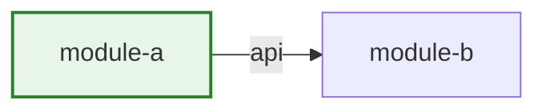

# PR Review Template

Strict output contract — same sections, same order, omit empty sections, add nothing else.
Never include PR/MR statistics (size, line/file counts), review-time estimates, CI status prose,
or checkbox checklists: the git host (GitHub or GitLab) already shows all of that. The verdict and
any blocking finding must fit in the first screenful.

---

<!-- deep-review sha:<head-sha> -->
<!-- Stamp the reviewed PR/MR head commit (Head SHA row of reference/platform-commands.md);
     deep-review-followup diffs against it. Update the stamp on every re-run. -->

## Summary

**Verdict: 💬 Comment** — [one clause: why this verdict (short, few words, 80 chars at most)]

<!-- Options: ✅ Approve | 💬 Comment | 🔄 Request Changes -->

[2–3 sentences: what the PR does and how. Not an inventory of everything you looked at.]

| Module      | Change                   |
| ----------- | ------------------------ |
| `orders`    | checkout flow + tests    |
| `shared/ui` | new `PriceTag` component |

<!-- One row per touched module. A cell holds at most two short lines — never a paragraph. -->
<!-- Module is only by one word in backticks (`ui-next`, `core`), to not extend -->

## 🔴 Blocking

**[Title]** — `path/to/file.ts:123`

<!-- Title = distilled headline for eye-scanning: short noun phrase naming the defect, ≤ ~50 chars,
     so title + path render as ONE line. Nuance goes in the evidence below, never in the title.
     Good: "Race condition in cart refresh" — Bad: "Cart refresh can race with checkout when two tabs are open". -->

[1–2 sentences of evidence.]
_Repro:_ [these inputs / this state → this wrong outcome]
_Fix:_ [suggested change]

## 🟡 Important

[Same shape as Blocking.]

## 🟢 Minor & suggestions

- 🟢 **`file.ts:45`** — [one-line nit]
- 💡 **`file.ts:88`** — [one-line alternative to consider]

## ❓ Questions

- [Genuine question about a decision — not a command phrased as a question.]

## Verified (no issues found)

- [At most 3 one-line bullets: non-obvious things checked that hold up — coverage evidence for co-reviewers, not praise.]

## Module Coupling Map

<!-- Only when the PR adds/changes a cross-module edge or a boundary violation exists.
     Single-module PRs, or multi-module PRs with no new edges: a note in the Summary table replaces the diagram.
     Changed modules highlighted; solid = public API edge, dashed red ⛔ = violation (must match a finding above). -->

## References Used

`house-rules.md`, `code-quality.md`, `react.md`, `typescript.md`
